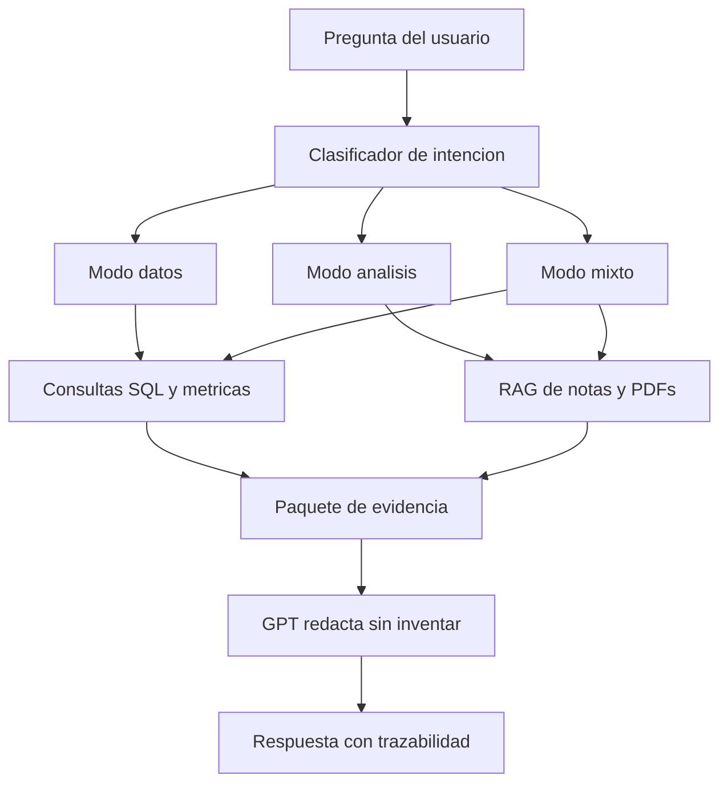

# Arquitectura del Asistente Comercial

## Vision

Construir un asistente comercial para Flotimatics que pueda operar con datos reales del CRM, contexto documental y razonamiento asistido por GPT.

No sera un chatbot libre. Sera un motor de respuestas trazables para ventas y supervision.

## Principios

- Zoho es la verdad operacional principal
- Los PDFs son la verdad documental comercial
- La web es complementaria y debe declararse
- GPT razona y redacta, pero no inventa datos
- Toda respuesta importante debe poder explicarse

## Tipos de preguntas

### Preguntas estructuradas

Se responden con consultas a la base normalizada.

Ejemplos:

- cuantos clientes tiene cada propietario
- quien contacto ayer
- clientes con mas de 30 dias sin seguimiento
- ultimo contacto registrado
- compromisos pendientes
- llamadas por vendedor

### Preguntas semiestructuradas

Se responden combinando SQL y notas.

Ejemplos:

- por que este prospecto se enfrio
- quien prometio regresar llamada
- quien rechazo y cual fue la razon

### Preguntas de conocimiento comercial

Se responden con PDFs y contexto de producto.

Ejemplos:

- que producto conviene ofrecer a este perfil
- diferencias entre soluciones
- argumentos comerciales segun industria

### Preguntas mixtas

Requieren CRM + PDFs + razonamiento.

Ejemplos:

- compara dos prospectos y dime a quien atacar primero
- a quien debo llamar hoy y con que enfoque

## Flujo deseado



## Modelo operativo recomendado

### 1. Capa de ingestion

Responsabilidades:

- extraer todos los modulos utiles de Zoho
- guardar raw JSON por modulo
- versionar fecha de sync
- registrar errores por modulo

Modulos minimos:

- Leads
- Contacts
- Notes
- Calls
- Events
- Tasks
- Users

Modulos deseables si Zoho lo permite:

- Activities
- Emails
- Attachments
- Timeline o campos auditables

### 2. Capa de normalizacion

Responsabilidades:

- convertir JSON raw a tablas limpias
- unificar `lead`, `contact`, `account`, `deal`, `owner`
- normalizar fechas, telefonos, correos y relaciones
- construir tabla de interacciones

Tablas recomendadas:

- `owners`
- `leads`
- `contacts`
- `notes`
- `calls`
- `events`
- `tasks`
- `interactions`
- `daily_activity_snapshot`
- `documents`
- `document_chunks`

### 3. Capa de recuperacion

#### SQL

Para:

- fechas
- conteos
- comparativas
- ranking
- seguimiento
- asignaciones

#### RAG de notas CRM

Para:

- objeciones
- compromisos
- resenas de reuniones
- razones de rechazo
- hallazgos cualitativos

#### RAG de PDFs

Para:

- productos
- beneficios
- diferenciadores
- respuestas comerciales

## Router de preguntas

El router debe clasificar:

- entidad principal
- horizonte temporal
- modo de respuesta
- fuentes necesarias
- si requiere web

Salida esperada del router:

```json
{
  "mode": "data|analysis|hybrid",
  "entities": ["lead", "contact", "owner", "deal"],
  "time_scope": "today|yesterday|last_30_days|custom|none",
  "sources": ["sql", "notes_rag", "pdf_rag"],
  "web_allowed": false
}
```

## Contrato de respuesta

### Si es modo datos

- responder directo
- solo campos solicitados
- sin explicacion extra

### Si es modo analisis

- hechos observados
- interpretacion
- recomendacion
- siguiente accion

### Si es modo mixto

- datos concretos
- explicacion breve
- recomendacion accionable

### Si uso web

Debe decir:

- que parte vino de la web
- por que se uso
- cuales fueron las fuentes

## Casos criticos que el sistema debe soportar

- "solo dame correos de X"
- "a quien llame ayer"
- "a quien debo llamar hoy y por que"
- "quien tiene mas clientes asignados"
- "quien tiene mas de 30 dias sin tocar una cuenta"
- "dime compromisos pendientes"
- "compara prospecto A vs prospecto B"
- "que producto conviene ofrecer aqui"

## Riesgos a evitar

- mezclar varios esquemas de base de datos
- usar GPT para adivinar datos faltantes
- perder trazabilidad de fechas e interacciones
- mezclar conocimiento web como si fuera conocimiento interno
- tener codigo fuente dentro de carpetas de datos

## Decisiones iniciales tomadas

- La fuente principal sera Zoho
- Los PDFs en `doc/` se indexaran como conocimiento de apoyo
- La web sera optativa y declarada
- El sistema tendra modo datos y modo analisis
- La entidad comercial principal comienza por `leads`, y debe reconocer su transicion a `contacts`

## Proximo paso tecnico recomendado

Construir un pipeline oficial unico:

1. `sync_zoho`
2. `build_warehouse`
3. `index_documents`
4. `answer_question`

Ese pipeline debe sustituir los flujos duplicados actuales.
